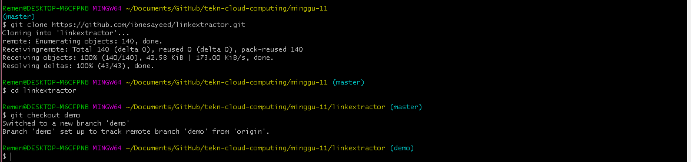
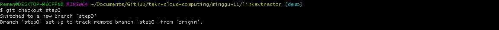
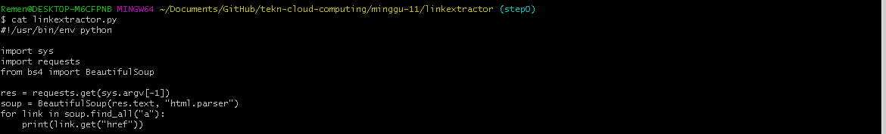
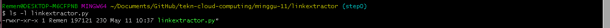
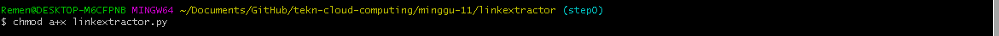
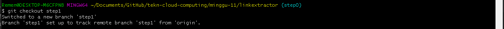
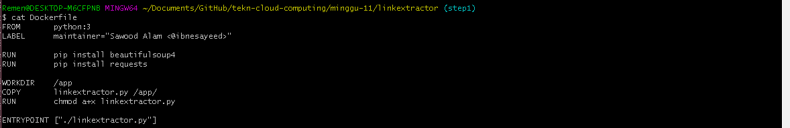
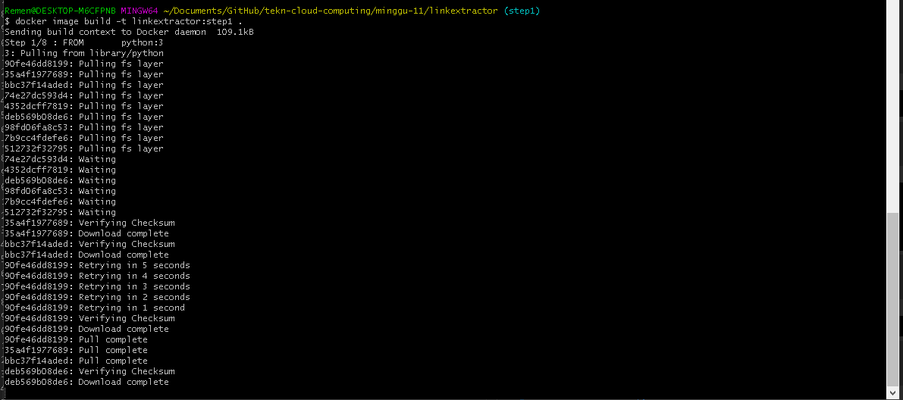
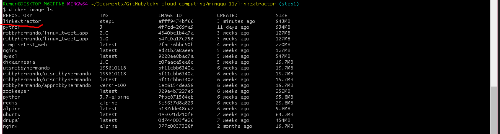

# LATIHAN & TUGAS

## STAGE SETUP

## STEP 0 : BASIC LINK EXTRACTOR SCRIPT
### LANGKAH 1
>Chekout step0

### LANGKAH 2
>Melihat isi linkextractor.py

### LANGKAH 3
>melihat permission data root

### LANGKAH 4
>root data linkextractor.py

## STEP 1 : CONTAINERIZED LINK EXTRACTOR SCRIPT
### LANGKAH 1
>Chekout step1

### LANGKAH 2
>isi dockerfile

### LANGKAH 3
>build docker image dengan nama linkextractor

### LANGKAH 4
>daftar image dockerfile

